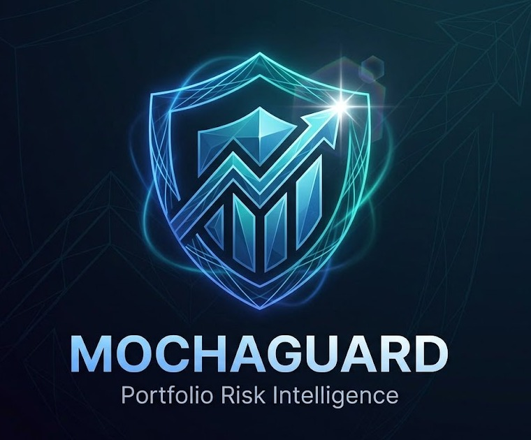
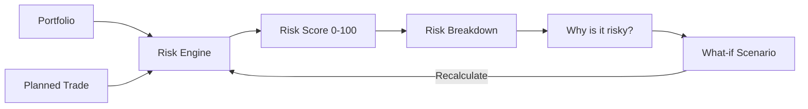

<div align="center">
  

  <h3>Portfolio Risk Intelligence for Leveraged Trades on Mochatrade</h3>

  <p>
    <strong>"Mochaguard doesn't tell users what to buy — it helps them understand what they're about to risk."</strong>
  </p>

  <p>
    
    
    
    
    
  </p>

  <p>
    Built by team <strong>CodePool</strong> for the <strong>Mochatrade YC P26 Hackathon</strong>, on top of the
    organizer's fork <code>Mochatrade-YC-P26-Mumbai-Hack</code>.
  </p>
</div>

---

## Table of Contents

- [Overview](#overview)
- [The Problem](#the-problem)
- [The Solution](#the-solution)
- [Features](#features)
- [How the Risk Engine Works](#how-the-risk-engine-works)
- [Architecture](#architecture)
- [Tech Stack](#tech-stack)
- [Quick Start](#quick-start)
- [Environment Variables](#environment-variables)
- [Testing](#testing)
- [Demo Script](#demo-script-under-60-seconds)
- [AI Integration & Fallback Behavior](#ai-integration--fallback-behavior)
- [Disclaimer](#disclaimer)
- [Roadmap](#roadmap)

---

## Overview

Mochatrade gives Indian traders leveraged, perpetual-futures exposure to US equities. **Mochaguard** sits on top of
that experience as a **pre-trade risk-analysis layer**: before a trader places a leveraged position, Mochaguard
shows them exactly how that trade would change their portfolio's risk, *why*, and lets them experiment with trade
size and leverage to watch the risk change in real time.

Mochaguard is **not** a stock predictor, a buy/sell signal generator, a portfolio tracker, or a chatbot. It answers
exactly one question:

> **"What am I actually risking if I place this trade?"**

## The Problem

India is the largest retail derivatives market in the world by volume. Yet leveraged trading tools generally show
P&L, margin, and liquidation price — and rarely show a trader how a *new* trade interacts with the portfolio they
*already* hold. A trader might already be heavily concentrated in one stock, one sector, or one foreign currency,
and a new leveraged position can quietly compound that risk without the platform ever surfacing it.

## The Solution

Mochaguard runs every planned trade through a small, **fully deterministic** risk engine that scores five factors —
concentration, volatility, currency exposure, sector concentration, and portfolio fit — combines them into a single
**0–100 score**, and explains the result in plain language. A **What-if** panel lets the trader adjust trade size,
leverage, or direction and see the score recalculate instantly, side by side with the original.

## Features

| | |
|---|---|
| 🧮 **Deterministic Risk Engine** | Five weighted factors, 0–100 score, LOW/MODERATE/HIGH/VERY HIGH — zero AI, zero randomness, fully reproducible. |
| 📊 **Portfolio Builder** | Add, edit, delete holdings with validation, live totals, sector exposure, and currency exposure. |
| 📝 **Planned Trade Form** | Ticker, direction, amount, leverage (1×/2×/5×/10×/20×), sector, currency. |
| 🔍 **Risk Breakdown** | Per-factor score, weight, and contribution to the total score, shown as bars. |
| 💬 **"Why is it risky?"** | Plain-language explanations generated from the *actual* calculated factors — AI-narrated when available, deterministic template fallback when not. |
| 🔄 **What-if Scenario** | Live sliders for amount/leverage/direction with an instant Before/After comparison and change explanation. |
| ⚡ **Demo Portfolio** | One click loads a realistic six-holding portfolio + a pre-filled leveraged NVDA trade — full flow in under a minute. |
| 🕘 **Analysis History** | Last 10 analyzed trades, for quick reference. |
| 📱 **Responsive Fintech UI** | Dark, dense, Bloomberg-inspired dashboard with loading/empty/error states and accessible controls. |

## How the Risk Engine Works

The risk engine (`src/risk/riskEngine.ts`) is **deterministic** — no AI, no randomness. The exact same portfolio
and trade will always produce the exact same score, which is verified in `src/risk/riskEngine.test.ts`.

> ⚠️ **The weights below are illustrative hackathon-MVP weights, not industry-standard risk methodology.**

| Factor | Weight | What it measures |
|---|---|---|
| **Concentration** | 30% | How much of the portfolio, after the trade, sits in this one asset. |
| **Volatility** | 25% | Sector-based volatility assumption, amplified by the chosen leverage. |
| **Currency Exposure** | 20% | How much of the portfolio, after the trade, is foreign-currency (non-INR) denominated. |
| **Sector Concentration** | 15% | How much of the portfolio, after the trade, sits in this one sector. |
| **Portfolio Fit** | 10% | Whether the trade duplicates an existing position/sector (higher risk) or diversifies away from it (lower risk). |

Each factor is a ratio of *exposure after the trade* to *total portfolio value after the trade*, normalized against
a configurable cap (e.g. concentration risk hits 100/100 once a single asset would represent 50% of the portfolio).
All caps and weights live in one file, `src/risk/constants.ts`, so they can be re-tuned without touching the
calculation logic.

Volatility uses an **illustrative, sector-based fallback assumption** (`BASE_VOLATILITY_BY_SECTOR`) rather than a
live market-data feed — clearly surfaced in the UI as an assumption, not real-time data.



## Architecture

```
src/
  app/                 # Next.js App Router
    api/explain/       # Server route: AI explanation, with safe fallback signaling
    page.tsx           # The dashboard (composes everything below)
    layout.tsx, globals.css
  components/          # UI only — no risk math lives here
  risk/                # Deterministic risk engine (source of truth) + explanation templates + tests
  services/            # RiskExplanationService — AI-or-fallback abstraction
  hooks/               # useMochaguard — app state, localStorage persistence
  data/                # Demo portfolio/trade (clearly labeled as demo)
  utils/               # Formatting, validation, storage helpers
  types/               # Shared TypeScript types
```

**Data storage:** the starting repository had no backend or database, so Mochaguard keeps the MVP simple: portfolio,
planned trade, and analysis history persist to the browser's `localStorage` (`src/utils/storage.ts`). All reads are
funneled through `useMochaguard`, so swapping in a real backend later means changing that one hook, not the UI.

## Tech Stack

- **Next.js 14** (App Router) + **React 18** + **TypeScript** (strict mode)
- **Tailwind CSS** — no UI component library, hand-built fintech-styled components
- **Vitest** for the risk-engine test suite
- No database — client-side state + `localStorage`
- Optional: **Anthropic API** for the AI explanation layer (server-side only, never exposed to the browser)

## Quick Start

```bash
npm install
npm run dev
```

Open [http://localhost:3000](http://localhost:3000) — no environment variables required to run the full app.

Production build:

```bash
npm run build
npm run start
```

## Environment Variables

Copy `.env.example` to `.env` if you want to enable the **optional** AI explanation layer:

```bash
cp .env.example .env
```

| Variable | Required? | Purpose |
|---|---|---|
| `ANTHROPIC_API_KEY` | No | Enables AI-narrated "Why is it risky?" explanations via `/api/explain`. If unset, the app automatically uses deterministic template explanations — nothing breaks. |

## Testing

```bash
npm run test
```

Covers: empty/invalid portfolio, low/high concentration, high leverage, currency exposure, sector concentration, a
diversifying trade, the what-if scenario, and a determinism check (same inputs always produce the same score).

## Demo Script (under 60 seconds)

1. Open the app → click **Load Demo Portfolio**. Six demo holdings + a pre-filled leveraged NVDA trade populate
   instantly, and the risk score appears immediately.
2. Point at **Risk Breakdown** — concentration and currency exposure dominate because the demo portfolio is already
   NVDA/Tech/USD-heavy.
3. Read **Why is it risky?** — the explanation is generated from the *same numbers* shown in the breakdown above it.
4. Open **What-if Scenario**, drag the trade amount down (₹1,00,000 → ₹50,000) and/or reduce leverage. Watch
   **Before/After** update instantly with a plain-language explanation of what changed.
5. Click **Apply this scenario as my planned trade** to lock in the reduced-risk version and see it land in
   **Recent Analysis**.

## AI Integration & Fallback Behavior

`src/services/riskExplanationService.ts` is the single entry point the UI calls (`explainRisk`). It calls the
server route `src/app/api/explain/route.ts`, which:

- Returns `{ disabled: true }` immediately if `ANTHROPIC_API_KEY` is not set.
- Otherwise sends the **already-calculated** risk result (never the raw portfolio math) to the model with strict
  instructions: never recalculate the score, never invent data, never recommend a trade, never claim certainty —
  only narrate the numbers it's given.
- Falls back to deterministic templates (`src/risk/explanations.ts`) on any error, timeout, or malformed response.

**The AI is exclusively an explanation layer. It cannot influence the risk score.** The app is fully functional —
portfolio, planned trade, risk score, breakdown, why-is-it-risky, and what-if — with zero environment variables
configured.

## Disclaimer

> Mochaguard provides educational risk analysis and does not provide financial advice or guarantee investment
> outcomes. The risk weights and volatility assumptions used are illustrative hackathon-MVP choices, not
> industry-standard risk methodology. Demo/illustrative data is labeled as such throughout the UI.

## Roadmap

- [ ] Real market-data provider for live volatility instead of the sector-based fallback assumption.
- [ ] Backend + database for multi-device portfolio sync (`useMochaguard` is already structured for this).
- [ ] Risk Q&A chat ("Why did my risk increase?") using the same `RiskExplanationService`, with a `question` field
      already wired into the API route.
- [ ] Historical risk-over-time charting from the analysis history already being recorded.
- [ ] Authentication and per-user persistence.

---

<div align="center">
  <sub>Built with ☕ by <strong>CodePool</strong> for the Mochatrade YC P26 Hackathon.</sub>
</div>

